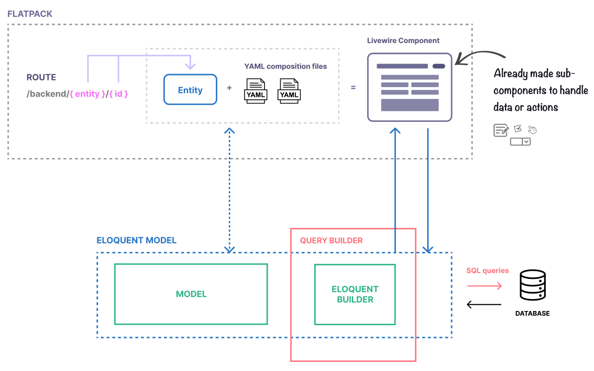

# Introduction

Flatpack is probably the quickest and simplest solution to create fast multi-purpose administration panel for your Laravel app.

Out of the box, it provides a rich stack of crafted components, ready to assemble.


With Flatpack you can:

-   Quickly create CRUD (Create, Read, Update, Delete) interfaces for your [Eloquent models](https://laravel.com/docs/8.x/eloquent).
-   Customise UI and components with simple and declarative [YAML](https://yaml.org/) files.
-   Build a complete and dynamic administration panel for your site in seconds.

## Installation

Install the package via composer:

```sh
composer require faustoq/laravel-flatpack
```

Publish the configuration file.

```sh
# This command will create `config/flatpack.php` configuration file.

php artisan vendor:publish --tag="config"
```

Publish the compiled assets.

```sh
# This command will copy Flatpack static assets (JS and CSS)
# in `public/flatpack/` directory.

php artisan vendor:publish --tag="public"
```

Flatpack is now ready.

Start by generating the template files for an Eloquent model.

## Usage

### Generating Flatpack files

In this example, we are going to generate the templates for `App\Models\Post` model.

```sh
php artisan make:flatpack Post
```

This command generates two files into the `/flatpack` directory:

-   A form template `/flatpack/posts/form.yaml`, that defines the composition of your posts form.
-   A list template `/flatpack/posts/list.yaml`, that defines the layout composition of your posts table with pagination.

Let's check the result: [http://localhost/backend/posts](http://localhost/backend/posts)

### Customizing form and list views

Now that Flatpack is up and running, we can start the assembling. The generated `form.yaml` and `list.yaml` can be [customized](/reference/) by defining **fields** or **columns** of your views.

Each one will map your Eloquent model attribute (if present) to a pre-made component with different options and capabilities (text editors, date pickers, handling relations, etc.).

Learn more about all the different types of [Form fields](/reference/form-fields) and [List columns](/reference/table-columns) and their options.

## Examples

The following examples showcase a `form.yaml` and `list.yaml` for a Post model. The form uses different input types (text, textarea and date pickers) with individual validation rules and options. The paginated table rendered in the list has some searchable and sortable columns.

### Form composition

Simple example of a custom `/flatpack/posts/form.yaml`
@[code](../examples/posts/simple-form.yaml)
Learn more: [Form reference](/reference/form-fields)

### List composition

Simple example of a custom `/flatpack/posts/list.yaml`
@[code](../examples/posts/simple-list.yaml)
Learn more: [List reference](/reference/table-columns)

## How it works

Flatpack helps you to quickly create Forms and Table (Lists) components that are mapped to an [Eloquent](https://laravel.com/docs/8.x/eloquent) model instance. It identifies the current model based on the `{entity}` route parameter.



**_Example:_**

The route `/backend/posts/` (parametrized as `/backend/{entity}/`) will show a Table component that automatically generates queries using the `App\Models\Post` model query builder (using rappasoft's [Livewire Tables](https://github.com/rappasoft/laravel-livewire-tables) under the hood).

The route `/backend/posts/42` (parametrized as `/backend/{entity}/{id}`) will automatically map the current entity to an instance of `App\Models\Post` with the id `42`.

YAML files define how a Form (or Table) component should look like, by mapping each form field (or table column) to a model's attribute.

```yaml
# /flatpack/posts/form.yaml

fields:
    title:
        type: text
        label: "Title"
        placeholder: "Your post title goes here"
        rules: required|email
```

The field `title` above is rendered as a `text` input, mapped to the `title` attribute of the current instance of `Post` (e.g. `$post->title`).

By default, Flatpack does not generate complete form or table templates, and does not include any action in the templates (**read only**). However, it offers a set of basic actions out of the box, that you just have to assign to a button element: `create`, `save` and `delete`.

Learn more about [Actions](/) and setting up [Custom Actions](/).
