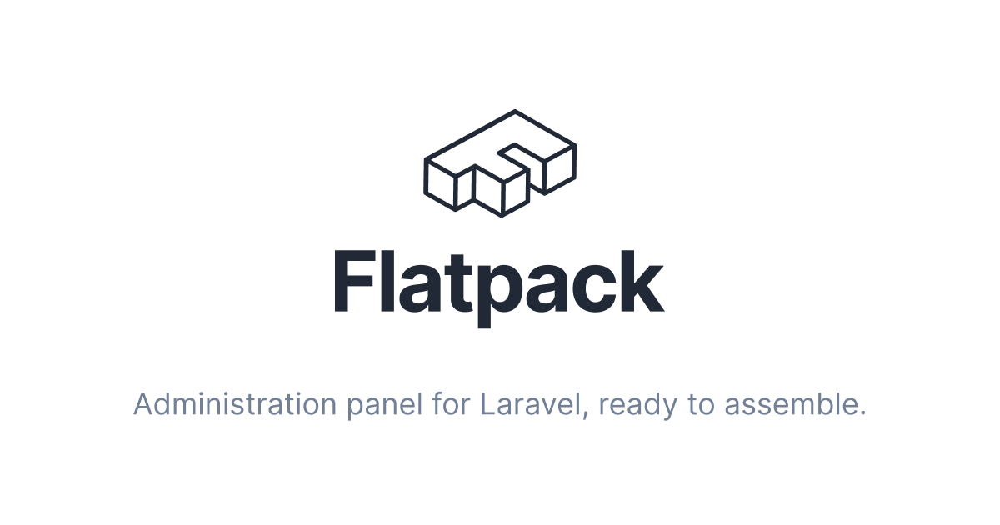

[](https://packagist.org/packages/flatpack/flatpack)
[](LICENSE.md)
[](https://github.com/laravel-flatpack/flatpack/actions/workflows/run-tests.yml)
[](https://github.com/laravel-flatpack/flatpack/actions/workflows/run-tests.yml)
[](https://github.com/laravel-flatpack/flatpack/actions/workflows/php-cs-fixer.yml)

# Flatpack

📦 Administration panel for Laravel, ready to assemble.

- Quickly create a CMS for your Eloquent models.
- Define components with simple and declarative YAML files.
- Build a complete administration panel for your Laravel app in seconds.

📕 [Official Documentation](https://laravel-flatpack.com)

[Flatpack](https://laravel-flatpack.com) makes building fully functional user interfaces for admin panels easier than ever: as easy as editing few lines of a YAML file. 

Besides providing a rich set of already built components and a solid stack to build a secure and intuitive experience for the users, it offers a fast and flexible solution for developers who want to have fun, try out new things and save precious time building up the an administration panels. 

Flatpack is a reactive full-stack app, built with [TALL stack](https://tallstack.dev/).


---
## Quick Install

You can install the package via composer:

```bash
composer require flatpack/flatpack
```

Publish the config file and compiled assets:

```bash
php artisan vendor:publish --tag="flatpack"
```

💡 To make sure that the public assets are always up-to-date, you should add this command to the `post-update-cmd` list in your `composer.json` file.


## Usage

Generating Flatpack composition files for `App\Models\Post` model...

```bash
php artisan make:flatpack Post
```

This command will create two files:

- A form template `/flatpack/posts/form.yaml`, that defines the layout composition of your posts form.
- A list template `/flatpack/posts/list.yaml`, that defines the layout composition of your posts table with pagination.

Let's check the result, visit `/backend/posts`.

Now start assembling, grab the generated files and define how they should look!

## Examples

Defining a form:

```yaml
title: Post
model: App\Models\Post
icon: book-open

toolbar:
  save:
    type: button
    label: Save
    action: save
    style: primary
    shortcut: s

main:
  title:
    label: Post Title
    placeholder: Your Post Title
    type: text

  body:
    type: block-editor

sidebar:
  created_at:
    label: Created
    type: datetime-picker

  updated_at:
    label: Updated
    type: datetime-picker
```

Defining a list:

```yaml
title: Post
model: App\Models\Post
icon: book-open

toolbar:
  create:
    label: New Post
    icon: plus
    link: create
    style: primary
    shortcut: enter

columns:
  id:
    label: ID
    sortable: true
    invisible: true

  title:
    label: Title
    sortable: true
    searchable: true

  created_at:
    label: Created
    type: datetime
    format: "Y-m-d H:i:s"
    sortable: true

  updated_at:
    label: Updated
    type: datetime
    format: "Y-m-d H:i:s"
    sortable: true
```

⚙️ You can customise the yaml composition files by mapping your model's attributes, using components of differnt types and features: Data tables, text inputs, rich text editors, date pickers, tag pickers, searchable select menus, image upload, toggles and more.

📖 [Check out the documentation](https://laravel-flatpack.com/reference)

## Requirements

- PHP 8.x
- Composer
- Laravel 9.x

## Changelog

Please see [CHANGELOG](CHANGELOG.md) for more information on what has changed recently.

## Contributing

Contributions are welcome! Please see [CONTRIBUTING](.github/CONTRIBUTING.md) for details.

## Security Vulnerabilities

Please review [our security policy](../../security/policy) on how to report security vulnerabilities.

## Credits

-   [Fausto Quaggia](https://github.com/faustoq)
-   [All Contributors](../../contributors)

## License

The MIT License (MIT). Please see [License File](LICENSE.md) for more information.
